# StudentPoll

[🚀 Live demo 🚀](https://browser-technologies.herokuapp.com/)

This project makes use of dirty tricks to maximize browser support through progressive enhancement.
This project will work with either with or without JavaScript in a very similar fashion.

The task for this application was to create a very solid **polling application** which could be used by **teachers** to poll students and view the results in **real-time**.
The key aspects for this app are highlighted, because they influenced my design choices.
The app contains two parts, one for the **teacher** and one for the **student**. It should be clear which part of the application is intended for who (the student just has to scan the QRCode or follow the link).

**Core functionality**

The core functionality of this application is to provide the teachers (or anyone for that matter) with a way to ask other people a question and view the results of what is being voted in a (semi-)live and thus real-time fashion.

**Reliable**

The user must be able to trust the statistics of the live-graph.

**Usable**

It must be accessible for pretty much everyone, regarding disability or browser.

**Pleasurable**

Add real real-time statistics when JavaScript is enabled and when the user uses a normal browser.
Actually show decent styling and transitions on certain events.

**Disclaimer**

This app might or might not work below IE6, the DOM manipulation guides of these old browsers are so vague it gave me a headache.
Massive respect for the people that ruined their life trying to make something out of JavaScript in the pre-IE6 era.

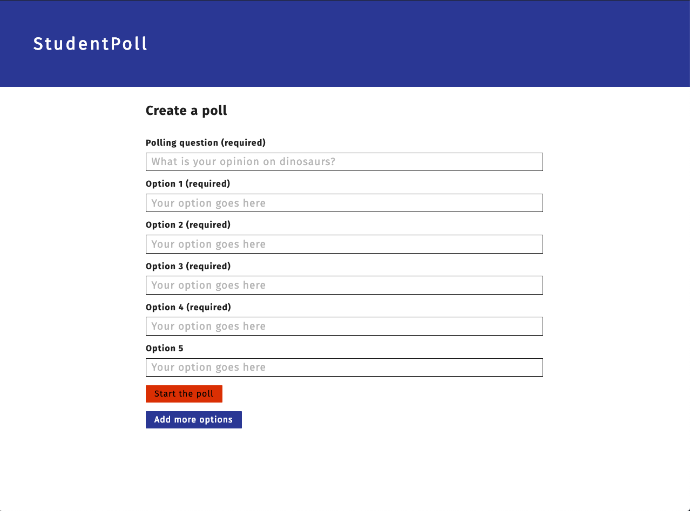
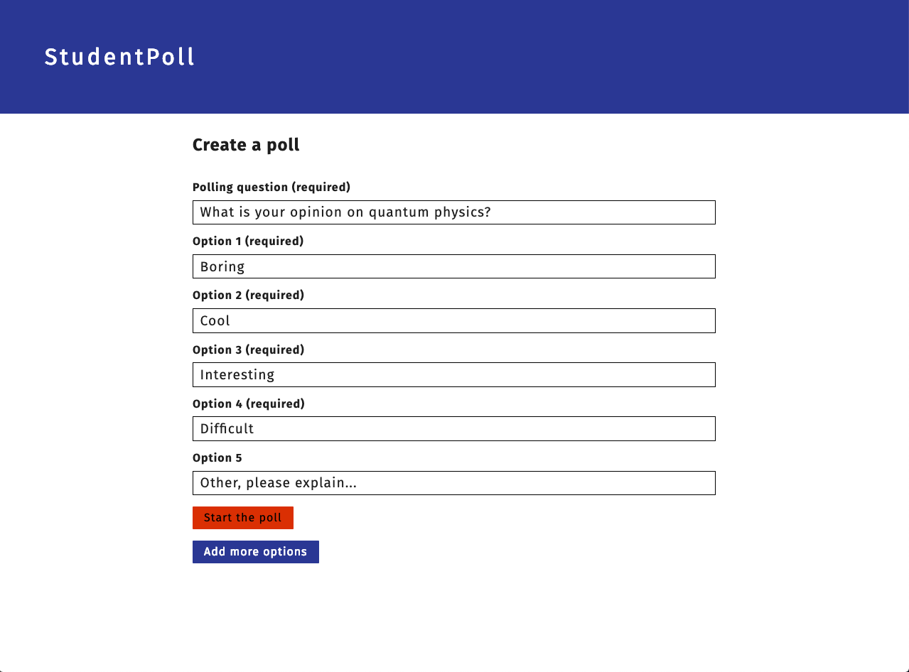
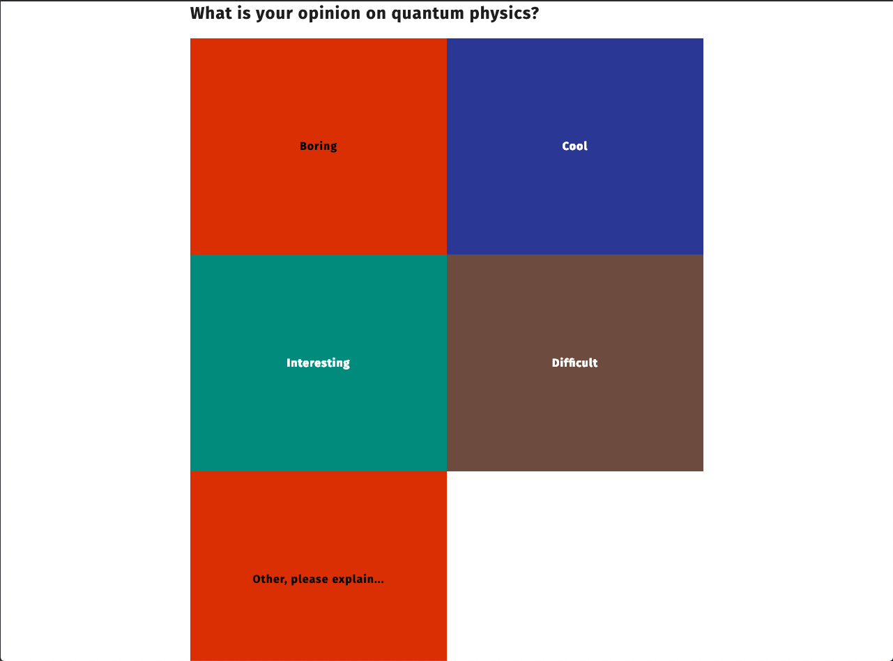
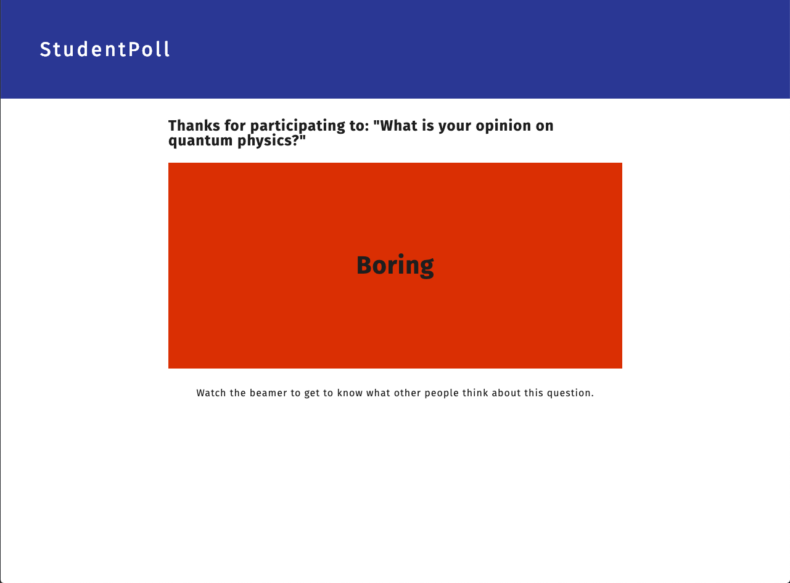


## Table of Contents

1. [Installation](#Installation)
2. [Exercises](#Exercises)
    1. [Exercise 1.2](#Exercise-1.2)
        1. [Feature tests and solutions](#Feature-tests-and-solutions)
            1. [Images](#Images)
            2. [Custom fonts](#Custom-fonts)
            3. [JavaScript off](#JavaScript-off)
            4. [Color](#Color)
            5. [Mouse / Trackpad](#Mouse-/-Trackpad)
            6. [Broadband](#Broadband)
            7. [Cookies](#Cookies)
            8. [LocalStorage](#LocalStorage)
        2. [Screen reader test](#Screen-reader-test)
        3. [Device lab test](#Device-lab-test)
    2. [Exercise 2](#Exercise-2)
        1. [HTML](#HTML)
        2. [CSS](#CSS)
        3. [Native JavaScript](#Native-JavaScript)
        4. [JavaScript Extra](#JavaScript-Extra)
3. [Future enhancements](#Future-enhancements)
4. [Checklist](#Checklist)
5. [Browser tests](#Browser-tests)
6. [Device Lab Application test](#Device-Lab-Application-test)
7. [License](#License)

### Installation

* Make sure to install [yarn](https://yarnpkg.com/en/) or [npm](https://www.npmjs.com).
* Make sure the **port** specified in the [index.ts](server/src/index.ts) is available (defaults to 3000).

* Clone the repository: `git clone git@github.com:Maikxx/browser-technologies-1819.git`.
* Navigate into the directory: `cd browser-technologies-1819`.
* Install dependencies: `yarn` or `npm install`.
* Start the server with: `yarn start-server` or `npm run start-server`.

## Exercises

### Exercise 1.2

The link to the repository for this exercise can be found [here](https://github.com/Maikxx/project-1-1819).

#### Feature tests and solutions

##### Images

When disabling images in my OBA application, most of the page still stands.
Things that break are:

* The logo, which has an alt text, and is not a disaster to not be there.
* MapBox still works, but has some weird behaviour, which I couldn't find out, it sometimes works, and sometimes doens't.
* Images of content items are broken, which is clumsy, but still workable, since there is all the metadata below it, like the title and the authors. This behaviour can be seen below.

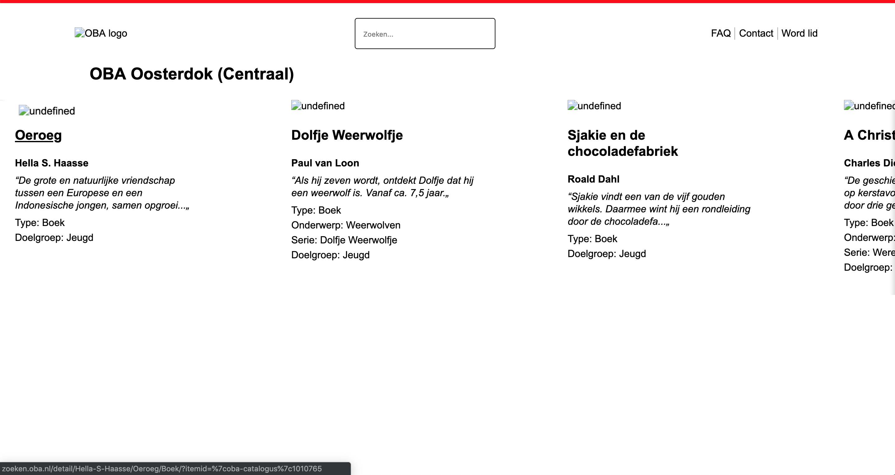

A simple improvement that can be made here is to fix the `alt="undefined"` to be `alt`, which still keeps the alt tag, while not showing the ugly placeholder alt text.

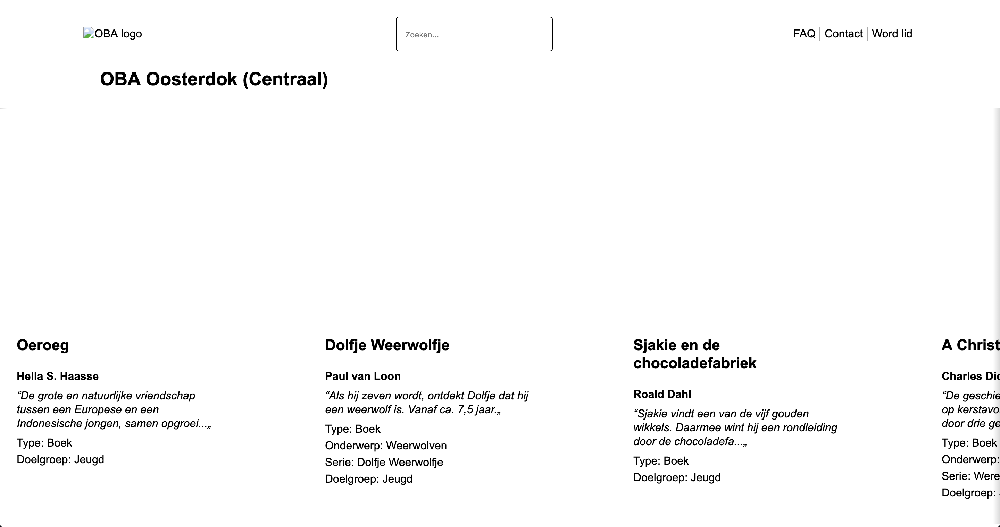

##### Custom fonts

This test is pretty easy, since there will not change anything to the interface when disabling custom fonts, since this application does not make use of custom fonts. If I were to be using custom fonts, I would have fallen back to another font because of this:  `font-family: Arial, Helvetica, sans-serif;`.

##### JavaScript off

When disabling JavaScript, it is simple, just a white page is shown, since everything is rendered into the `main` element from JavaScript.
This can be solved (which I am not going to do right now, because that is an issue for the other course) is to render the application on the server and send it to the client. This would show a lot of the content just fine, with the exeption for the map on the homepage.

As far as page navigation goes, nothing will work either right now, since I am using buttons to push the history state, while if I were to use anchor tags, with server side rendering a lot more of the pages would work.

##### Color

On MacOS, you can invert the colors by pressing `CMD + Option + F5`.
My application works surpisingly well, seeing as I didn't spend any time in this mode while designing.
There only appears an issue when watching the floorplans, where the toilets and elevators are hard to see against the background.

I tried to make screenshots from this, however to my (dumb) surprise screenshots from this mode are not taken in the inverted mode. You will need to test it out yourself in the live version to view it.

##### Mouse / Trackpad

When not using the mouse, I cannot navigate to the next page each time, since the dots on the map are `div`s instead of `button`s.

This can be fixed on the first page, however the second page contains a more difficult task to improve this, since the `polygon` shapes have an event listener on them. If you know anything about HTML, you know that you can't **directly** append a `button` to an `svg` element.

You could solve this by doing something like this:

```html
<foreignObject>
    <html:button></html:button>
</foreignObject>
```

This however would require additional positioning, which I will not do right now, but it is possible.

The final page with all the suggestions works fine without a mouse or trackpad.

##### Broadband

When I first ran the audits test in Google Chrome on a 13inch MacBook from 2015, the results were pretty shocking, as can be seen below.

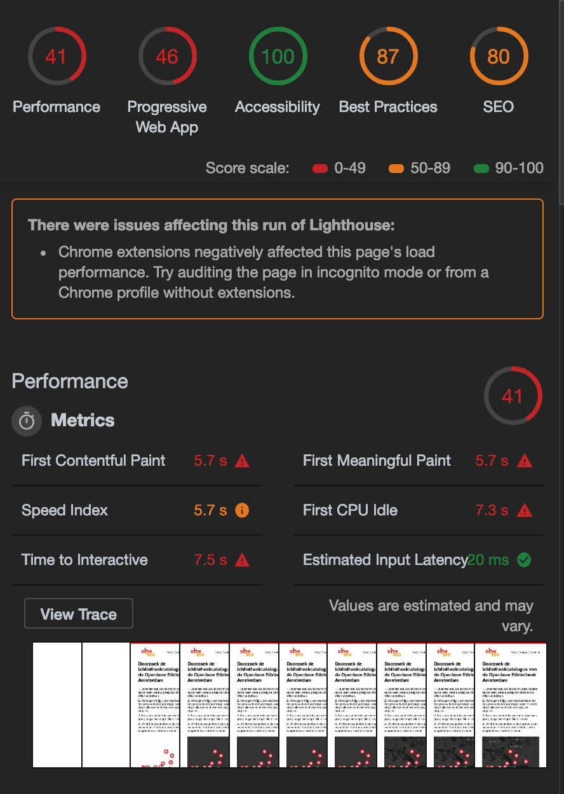

However, when looking into the issues that it gave me in the audits tab, I realized I was testing the local development version, which has no compression and minification.

The live test results (from [Netlify](https://minor-web-project-1.netlify.com/)) can be seen below.

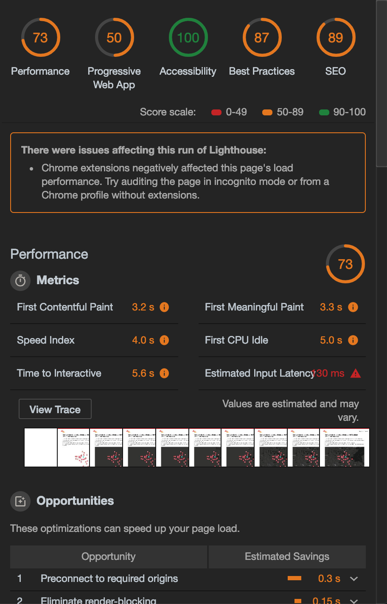

The main issue that can be seen here is that the MapBox css stylesheet is blocking the render flow (0.15s), and that it takes about 3.2 seconds before the page displays meaningful content, due to the fact that everything is rendered with JavaScript, which first needs to be parsed and executed.

Modified this code `<link href="https://api.mapbox.com/mapbox-gl-js/v0.52.0/mapbox-gl.css" rel="preconnect">` to have `rel="preconnect"` instead of `rel="stylesheet"`.

This however broke MapBox, because it couldn't recognize that it's required stylesheet was loaded in.

The only way to further improve the performance is to fetch all data on the server and just send the rendered page back to the user.

I have kept in mind the slow API of the OBA when fetching book suggestions with a loader though.

##### Cookies

I don't use cookies in this application, however, this application uses localStorage as can be seen in the section below, which causes a bit of trouble when turning off cookies (which is bound to localStorage, for some reason).

##### LocalStorage

When turning off the localStorage (by turning off cookies), the page loads as usual, it also navigates as usual to the second page, but when navigating to the third page everything breaks. This is caused by the fact that localStorage access is disallowed, where JavaScript is looking for it. Because there is a `try/catch` block surrounding the localStorage pieces, it enters the `catch` block. Ideally you would continue fetching data in the `catch` block, when the `localStorage` is not available.

#### Screen reader test

You can activate the MacOS screen reader with `CMD + Option + F5`.

Since refactoring the maps markers to be `button` elements instead of `div` elements, the screen reader is able to walk through this part of the application.

As could be seen in the screenshots above, the accesibility score is pretty high, due to semantic setup of the pages, with a few exceptions that are discussed above.

It appears to be pretty much not necessary to use ARIA attributes on most of the pages, with maybe the exception of the floorplan svg elements.

#### Device lab test

The device lab test for the OBA application was not very useful, since the app full on crashed on all the browsers on the devices. This might be due to the fact that I did not specify for these kind of browsers. Unfortunately the set up for the device lab took way more than the time it actually helped me. The reason that the browsers don't work is because I did write only ESNext code and did not compile it down to ES3, on which these browsers run.

### Exercise 2

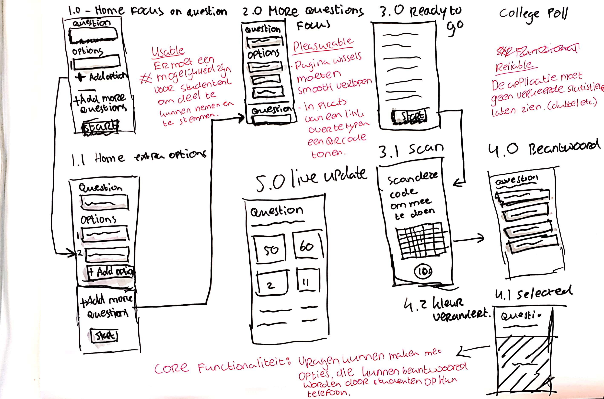

#### HTML

* [Input type: number](https://developer.mozilla.org/en-US/docs/Web/HTML/Element/input/number). Supported from IE10.

* [Main HTML element](https://developer.mozilla.org/en-US/docs/Web/HTML/Element/main). Supported from Edge.

* [Meta refresh](https://css-tricks.com/snippets/html/meta-refresh/). Supported in all major browsers. There is a quirk with this, that you can't remove this runtime, which required me to wrap it in a set of `noscript` tags, because otherwise the browser would keep refreshing even if you would have Sockets.

* [Section HTML element](https://developer.mozilla.org/en-US/docs/Web/HTML/Element/section). Supported from IE9.

#### CSS

* [VW/VH Unit](https://developer.mozilla.org/en-US/docs/Web/CSS/length).

    [Supported from IE9](https://caniuse.com/#search=vw).

* [CH Unit](https://developer.mozilla.org/en-US/docs/Web/CSS/length).

    [Supported from IE9](https://www.quirksmode.org/css/units-values/#t00).

* [Flexbox](https://developer.mozilla.org/en-US/docs/Web/CSS/flex).

    [Effectively supported from Edge](https://caniuse.com/#search=display%3A%20flex). Unfortunately I was told not to prefix CSS, which causes Internet Explorer to not work with flexbox.

* [CSS3 Selectors](https://developer.mozilla.org/en-US/docs/Glossary/CSS_Selector).

    [Fully supported from IE9](https://caniuse.com/#feat=css-sel3).

* [CSS3 Colors](https://developer.mozilla.org/en-US/docs/Web/CSS/color).

    [Supported from IE9](https://caniuse.com/#feat=css3-colors).

* [Web Fonts](https://developer.mozilla.org/en-US/docs/Web/CSS/@font-face).

    [Fully supported from IE9](https://caniuse.com/#feat=fontface).

#### Native JavaScript

* [element.getElementsByClassName](https://developer.mozilla.org/en-US/docs/Web/API/Element/getElementsByClassName).

    [Supported from IE9](https://developer.mozilla.org/en-US/docs/Web/API/Element/getElementsByClassName#Browser_compatibility).

* [element.getElementsByTagName / element.appendChild / element.setAttribute / element.className](https://www.w3.org/TR/2000/REC-DOM-Level-2-Core-20001113/core.html).

    [Supported from IE6](https://caniuse.com/#search=DOM%20core%20level%202).

* [element.querySelector / element.querySelectorAll](https://developer.mozilla.org/en-US/docs/Web/API/Element/querySelector).

    [Supported from IE8/IE9](https://developer.mozilla.org/en-US/docs/Web/API/Element/querySelector#Browser_compatibility).

* [Location API](https://developer.mozilla.org/en-US/docs/Web/API/Location).

    [Supported as intended from Firefox 22](https://developer.mozilla.org/en-US/docs/Web/API/Location#Browser_compatibility).

* [Node.innerText](https://html.spec.whatwg.org/multipage/dom.html#the-innertext-idl-attribute).

    [Supported from IE6 and Firefox 44](https://caniuse.com/#feat=innertext).

* [Node.textContent](https://developer.mozilla.org/en-US/docs/Web/API/Node/textContent).

    [Supported from IE9](https://caniuse.com/#search=textContent).

* [String.prototype methods](https://www-archive.mozilla.org/js/language/E262-3.pdf).

    [Supported from IE6](https://caniuse.com/#search=EcmaScript%203%20String.prototype%20methods).

#### JavaScript Extra

* [Socket.io](https://socket.io/). Supported from IE6.
* [QRCodeJS](https://github.com/davidshimjs/qrcodejs). Supported from IE6.

## Future enhancements

* [X] Add ability to add more than 4 options. (**Major**).
* [ ] Add feedback for cases where the user is offline and / or is loading something. (**Medium**).
* [ ] Add long polling for situation where Sockets is not loaded for some reason. (**Medium**).
* [ ] Add scaling to the graph. (**Medium**).
* [ ] Add support for polling multiple questions at once (**Major**).
* [ ] Fix memory leak caused by Socket.io updating every score window for every update (**Medium**).
* [ ] Fix styling on legacy browsers.

## Checklist

1. [X] Images

    Disabling images will do nothing to the only place where I use an image, which is in the waiting room, as can be seen here. 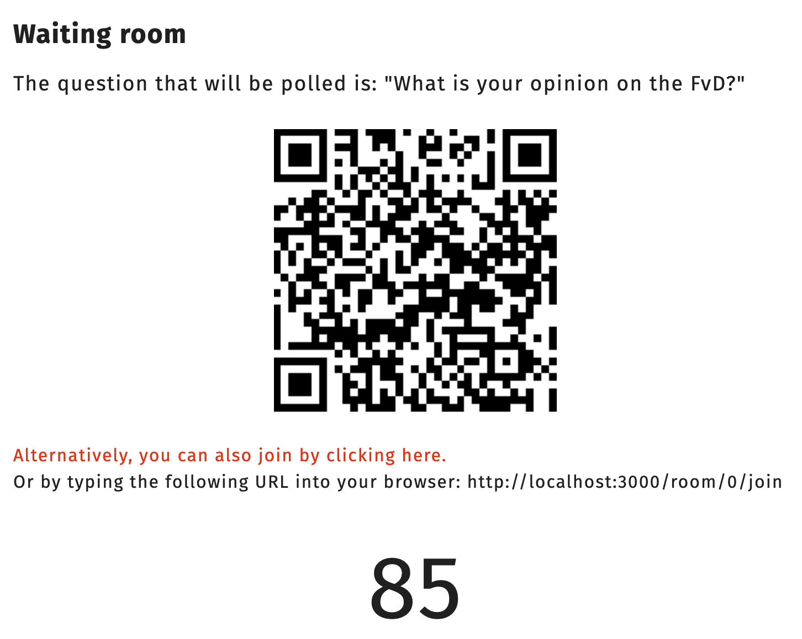. This is, because the QRCode library creates an image when images are available, and otherwise creates the QRCode with `canvas`.

2. [X] Custom fonts

    With custom fonts: 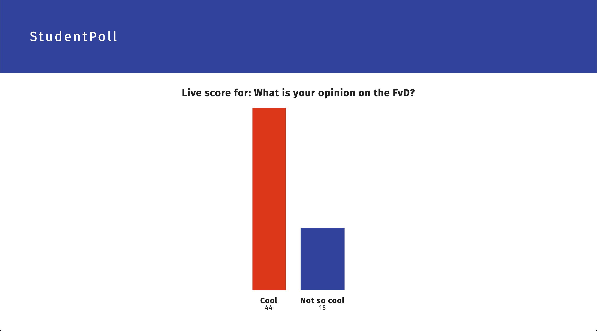.
    Without custom fonts: .
    This does not cause any major issues, besides the fact that the sizes are a bit off.

3. [X] JavaScript off

    Without JavaScript the application provides the core functionality of the application. Making use of mainly POST form submissions to mock interaction. Also to view the live score without JavaScript, the page will refresh every 5 seconds.

4. [X] Color

    Every page is checked by using the audits tab in Google Chromes Devtools.
    Here is an image of one of the pages that passed the color blindness tests. 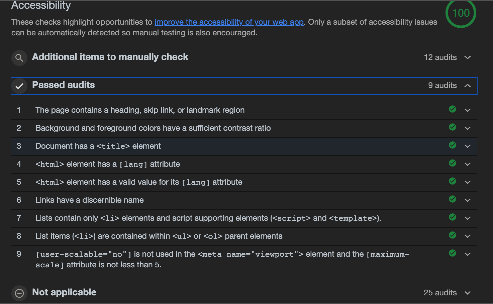.
    Also the Axe accesible extension provides no issues. 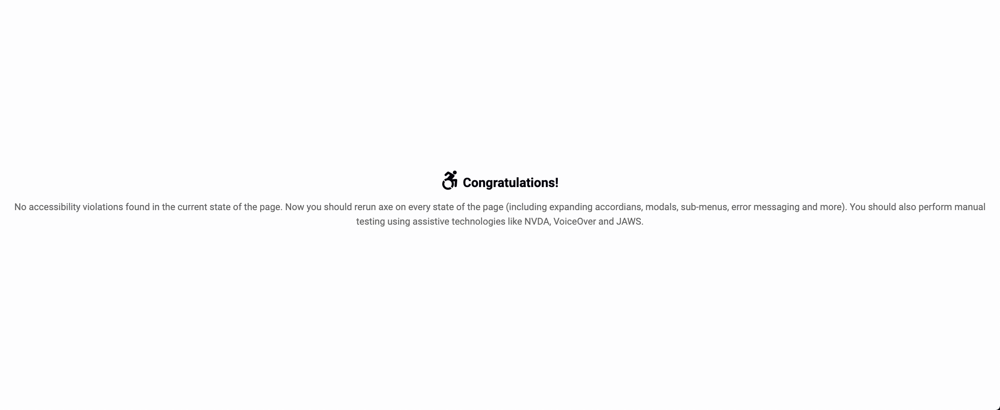.

5. [X] Mouse / Trackpad

    Tab support for all the pages works as expected due to the fact that a good HTML structure is used.

6. [X] Broadband

    If you don't have internet, you won't be able to access the site, simple as that, I did not have enough time to implement offline functionality. I also did not add loaders or feedback for loading scripts or pages. Added this to the [Future enhancements](#Future-enhancements). Besides all this, the page is still pretty fast on very slow connections. 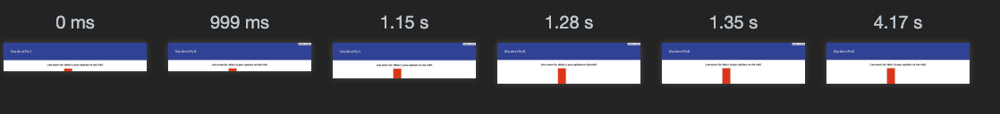. Much can be improved here, but in my opinion this is fine for the demo.

7. [X] Cookies / localStorage

    This app does not make use of cookies and / or localStorage.

## Browser tests

I have tested this application on a couple of browsers:

* VirtualBox Internet Explorer (**5 - 11**)
* VirtualBox Edge
* Google Chrome (**latest**)
* Firefox (**latest**)
* Brave Browser (**latest**)
* TorBrowser (**latest**)
* Safari (**latest**)

As you can see in the screenshots below, Internet Explorer just breaks all over the place on styling. I might or might not have time anymore to fix some of these.
The target browser I was going for was IE6 and up. As far as I could test, you can still perform the core functionalities in IE7 (IE6 somehow does not get it's own version on VirtualBox).


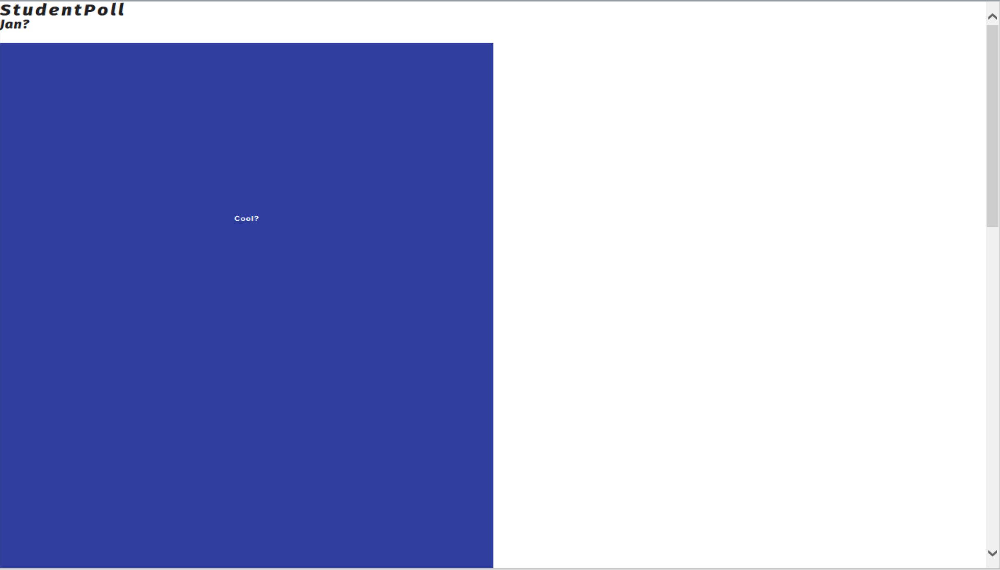
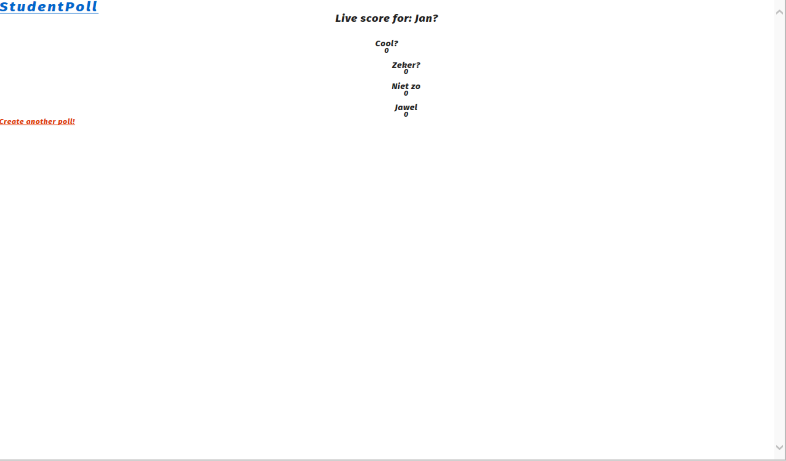

When looking at IE11, the application works pretty much as expected, except for the fact that flexbox is not supported, as you can see below.

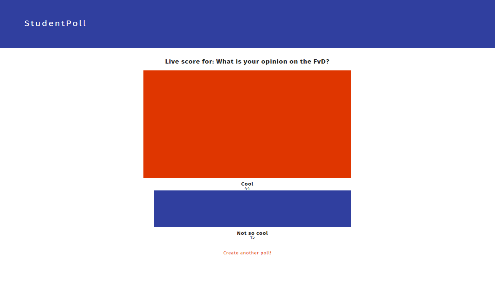

In Brave, Google Chrome, Firefox, Safari and TorBrowser (with JavaScript and a major delay due to the VPN) it works as intended.

## Device Lab Application test

When testing on the device lab, the application worked as it should on most of the devices, the styling looked pretty much fine, with the exception of a few quirks. You can see the proof that I did this below...

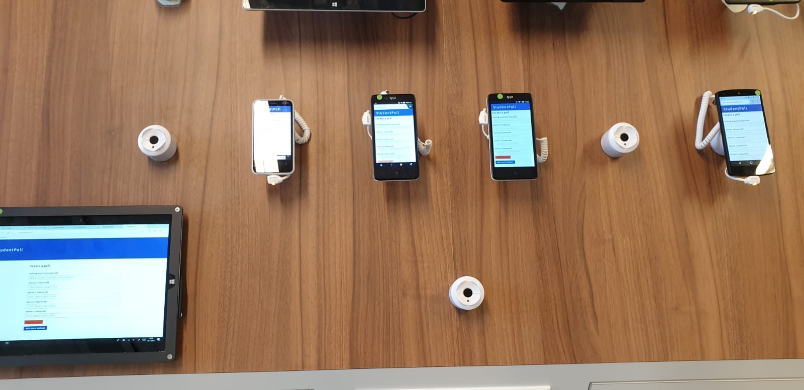

## License

This repository is licensed as [MIT](LICENSE) by [Maikel van Veen](https://github.com/maikxx).